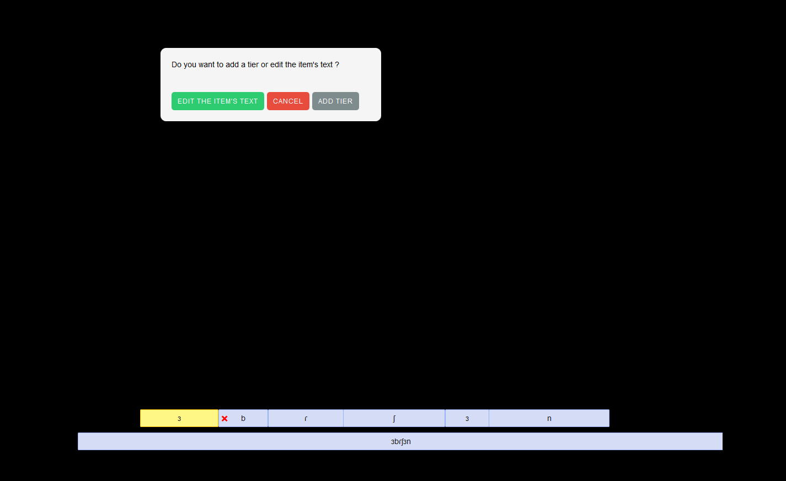

# TextGridShiny - Create interactive annotation interfaces for speech with R and Shiny
&nbsp;&nbsp;&nbsp;&nbsp;&nbsp;&nbsp;*Copyright 2018 Mohamed El Idrissi. Licensed under the MIT license.*

## Introduction

TextGridShiny allows to read TextGrid files, from the software PRAAT, and to display annotations describing representations of sound recordings. In addition, it is possible to interact with the created visual annotation by adding tiers and labels. Note that this package is in development. 


 
 <h2 id="install">
 
## Installation

</h2>

`TextGridShiny` is available through both CRAN and GitHub:

To install the stable CRAN version:

``` r
install.packages("TextGridShiny")
```

To install the latest development version from GitHub:

``` r
install.packages("devtools")
devtools::install_github("buhem/TextGridShiny")
```

## Usage

<h3 id="interactivity">

Interactivity

</h3>

This widget allows the user to interact with it. You can easily add tiers or change the items' text. For that, you need to double-click on an item. Then a dialog box opens displaying the choices in question.



Plus, it lets you remove or add labels which can be positioned on the timeline at the place chosen to annotate your data. The width of the item can be manually adjusted and resized. The removal of a label can be realized by clicking on the cross icon who appears if you select the item. But a label is added by double-clicking in an empty space on the tier. 

<h3 id="shiny">

In Shiny

</h3>

TextGridShiny offers the possibility of being connected to a Shiny app by adding `TextGridShinyOutput()` inside the UI function and `renderTextGridShiny(TextGridShiny())` inside the server function.


### In R Markdown Document

R Markdown can create a HTML document and you can include in it Shiny packages. For invoking them, you need to indicate at the beggining of the document, in the front-matter, the fact that you are going to use Shiny.

```
---
runtime: shiny
---
```

Then merely put down in the chunk these lines of code.

<pre>
```{r, echo=FALSE}
library(TextGridShiny)
renderTextGridShiny(TextGridShiny())
```
</pre>

## Demo

[Click here](https://sudoranais.shinyapps.io/Analysis_Processing_Rhotic_Alveolar/) to view a live demo of **TextGridShiny**.


## Limitations

For now, the dialog box doesn't work in some OS' like iOS.
